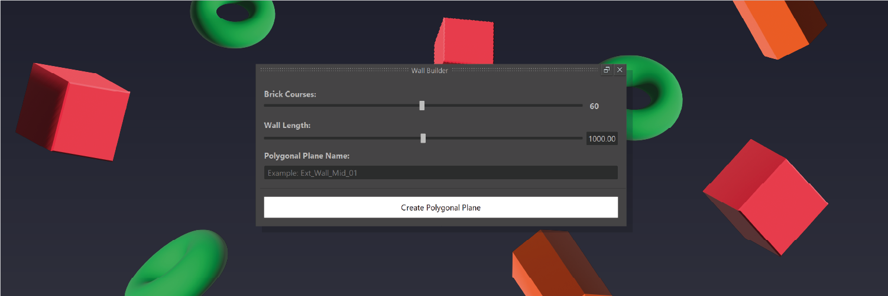

# Maya Wall Builder

<a href="https://github.com/KieronJenkins" target="_blank">
<a href="https://uk.linkedin.com/in/kieronjenkins" target="_blank">
<a href="https://www.python.org/" target="_blank">

## About
The **Wall Builder** was created to make life easier for artists working out dimensions of walls from architectural plans by calculating the height and length of a wall from two inputs.

## One main objectives
1. The wall builder must calculate the height and length of walls based on a users inputs.

## Using the wall builder
To use the wall builder enter the amount of brick courses in the first input box and the overall length in the second and click 'Create Wall' and a wall will be created in your Maya scene.

## Why create a wall builder
If something can be created to speed up the process of creating assets without having a destructive affect on a pipeline no matter how simple can be made then it should be made in order to help those who need it.
